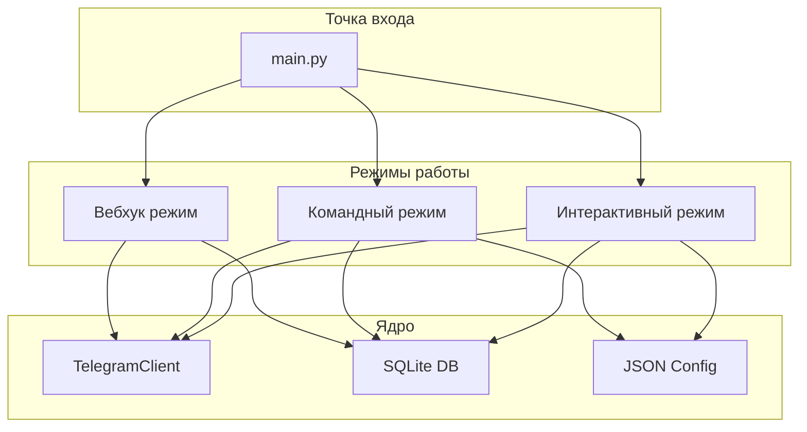

# Архитектура приложения

## Обзор

Telegram Channel Manager построен по модульной архитектуре с разделением на три слоя:
- **Точка входа** - обработка аргументов и выбор режима
- **Режимы работы** - реализация пользовательских интерфейсов
- **Ядро** - бизнес-логика и работа с данными

## Диаграмма архитектуры



## Компоненты

### Точка входа (main.py)

Отвечает за:
- Разбор аргументов командной строки через `argparse`
- Проверку переменных окружения (`TELEGRAM_API_ID`, `TELEGRAM_API_HASH`)
- Выбор и запуск соответствующего режима работы

### Режимы работы

#### Интерактивный режим (modes/interactive.py)
- Многоуровневое текстовое меню
- Пошаговое взаимодействие с пользователем
- Подходит для первоначальной настройки и изучения

#### Командный режим (modes/command.py)
- Выполнение задач через CLI аргументы
- Подходит для автоматизации и скриптов
- Поддержка вывода в различных форматах (text, JSON)

#### Вебхук режим (modes/webhook.py)
- FastAPI HTTP сервер
- REST API для отправки сообщений
- Swagger документация на `/docs`

### Ядро

#### TelegramClient (core/telegram_client.py)
- Обёртка над библиотекой Telethon
- Авторизация и управление сессией
- Получение и отправка сообщений

#### Database (core/database.py)
- SQLite база данных
- CRUD операции для сообщений и отправителей
- История реакций

#### Config (core/config.py)
- JSON файл конфигурации
- Хранение выбранных каналов
- Настройки вебхука

## Потоки данных

### Получение сообщений

```
Telegram API → TelegramClient → Database → Formatters → Output
```

1. `TelegramClient` получает сообщения через Telethon
2. Сообщения сохраняются в `Database`
3. `Formatters` преобразуют данные в нужный формат
4. Результат выводится или отправляется по URL

### Отправка сообщений (Webhook)

```
HTTP Request → FastAPI → TelegramClient → Telegram API
```

1. FastAPI принимает POST запрос
2. Валидация и извлечение данных
3. `TelegramClient` отправляет сообщение
4. Возврат результата клиенту

## Принципы проектирования

- **Разделение ответственности** - каждый модуль отвечает за свою область
- **Асинхронность** - использование `asyncio` для I/O операций
- **Конфигурируемость** - настройки через переменные окружения и JSON
- **Расширяемость** - легко добавить новые режимы или функции
