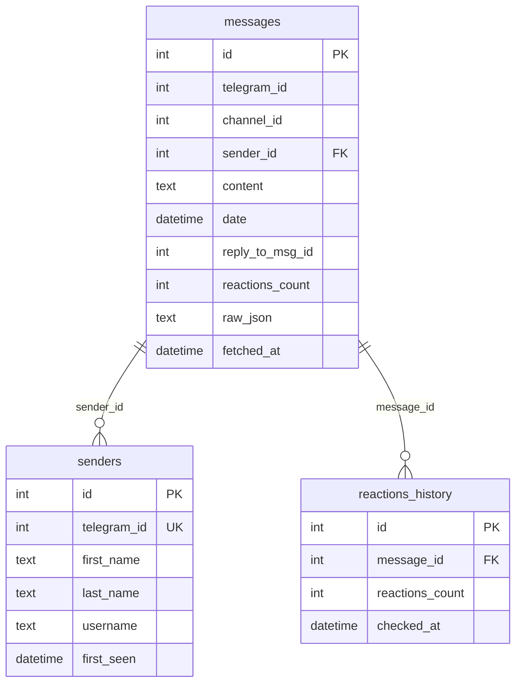

# Схема базы данных

## Обзор

Приложение использует SQLite для хранения данных. База данных создаётся автоматически при первом запуске в файле `data.db`.

## ER-диаграмма



## Таблицы

### senders - Отправители сообщений

Хранит информацию о пользователях, отправивших сообщения.

| Поле | Тип | Описание |
|------|-----|----------|
| `id` | INTEGER | Первичный ключ (автоинкремент) |
| `telegram_id` | INTEGER | Уникальный ID пользователя в Telegram |
| `first_name` | TEXT | Имя пользователя |
| `last_name` | TEXT | Фамилия пользователя |
| `username` | TEXT | Username (@username) |
| `first_seen` | DATETIME | Дата первого появления в базе |

**Индексы:**
- `idx_senders_telegram_id` на `telegram_id`

**Ограничения:**
- `telegram_id` - UNIQUE

### messages - Сообщения

Хранит сообщения из каналов.

| Поле | Тип | Описание |
|------|-----|----------|
| `id` | INTEGER | Первичный ключ (автоинкремент) |
| `telegram_id` | INTEGER | ID сообщения в Telegram |
| `channel_id` | INTEGER | ID канала/чата |
| `sender_id` | INTEGER | FK на senders.id |
| `content` | TEXT | Текст сообщения |
| `date` | DATETIME | Дата отправки сообщения |
| `reply_to_msg_id` | INTEGER | ID сообщения, на которое ответили |
| `reactions_count` | INTEGER | Общее количество реакций |
| `raw_json` | TEXT | Сырые данные в JSON формате |
| `fetched_at` | DATETIME | Дата получения сообщения |

**Индексы:**
- `idx_messages_channel` на `channel_id`
- `idx_messages_date` на `date`
- `idx_messages_reply` на `reply_to_msg_id`

**Ограничения:**
- UNIQUE(`telegram_id`, `channel_id`) - уникальность сообщения в канале

### reactions_history - История реакций

Хранит снимки количества реакций для отслеживания изменений.

| Поле | Тип | Описание |
|------|-----|----------|
| `id` | INTEGER | Первичный ключ (автоинкремент) |
| `message_id` | INTEGER | FK на messages.id |
| `reactions_count` | INTEGER | Количество реакций на момент проверки |
| `checked_at` | DATETIME | Дата проверки |

## SQL-схема

```sql
-- Таблица отправителей
CREATE TABLE senders (
    id INTEGER PRIMARY KEY AUTOINCREMENT,
    telegram_id INTEGER UNIQUE NOT NULL,
    first_name TEXT,
    last_name TEXT,
    username TEXT,
    first_seen DATETIME DEFAULT CURRENT_TIMESTAMP
);

-- Таблица сообщений
CREATE TABLE messages (
    id INTEGER PRIMARY KEY AUTOINCREMENT,
    telegram_id INTEGER NOT NULL,
    channel_id INTEGER NOT NULL,
    sender_id INTEGER,
    content TEXT,
    date DATETIME,
    reply_to_msg_id INTEGER,
    reactions_count INTEGER DEFAULT 0,
    raw_json TEXT,
    fetched_at DATETIME DEFAULT CURRENT_TIMESTAMP,
    FOREIGN KEY (sender_id) REFERENCES senders(id),
    UNIQUE(telegram_id, channel_id)
);

-- Таблица истории реакций
CREATE TABLE reactions_history (
    id INTEGER PRIMARY KEY AUTOINCREMENT,
    message_id INTEGER NOT NULL,
    reactions_count INTEGER NOT NULL,
    checked_at DATETIME DEFAULT CURRENT_TIMESTAMP,
    FOREIGN KEY (message_id) REFERENCES messages(id)
);

-- Индексы
CREATE INDEX idx_messages_channel ON messages(channel_id);
CREATE INDEX idx_messages_date ON messages(date);
CREATE INDEX idx_messages_reply ON messages(reply_to_msg_id);
CREATE INDEX idx_senders_telegram_id ON senders(telegram_id);
```

## Примеры запросов

### Получить сообщения с отправителями

```sql
SELECT m.*, 
       s.telegram_id as sender_telegram_id,
       s.first_name as sender_first_name,
       s.last_name as sender_last_name,
       s.username as sender_username
FROM messages m
LEFT JOIN senders s ON m.sender_id = s.id
WHERE m.channel_id = ?
ORDER BY m.date DESC;
```

### Найти сообщения с изменениями реакций

```sql
SELECT m.*,
       rh_old.reactions_count as old_reactions,
       rh_new.reactions_count as new_reactions,
       (rh_new.reactions_count - rh_old.reactions_count) as reactions_change
FROM messages m
JOIN reactions_history rh_new ON m.id = rh_new.message_id
JOIN reactions_history rh_old ON m.id = rh_old.message_id
WHERE rh_new.checked_at = (
    SELECT MAX(checked_at) FROM reactions_history 
    WHERE message_id = m.id
)
AND rh_old.checked_at = (
    SELECT MIN(checked_at) FROM reactions_history 
    WHERE message_id = m.id
    AND checked_at >= datetime('now', '-24 hours')
)
AND rh_new.reactions_count != rh_old.reactions_count
ORDER BY reactions_change DESC;
```

### Статистика по каналам

```sql
SELECT channel_id, 
       COUNT(*) as message_count,
       MIN(date) as first_message,
       MAX(date) as last_message
FROM messages
GROUP BY channel_id
ORDER BY message_count DESC;
```

### Топ отправителей

```sql
SELECT s.*, COUNT(m.id) as message_count
FROM senders s
LEFT JOIN messages m ON s.id = m.sender_id
GROUP BY s.id
ORDER BY message_count DESC
LIMIT 10;
```
